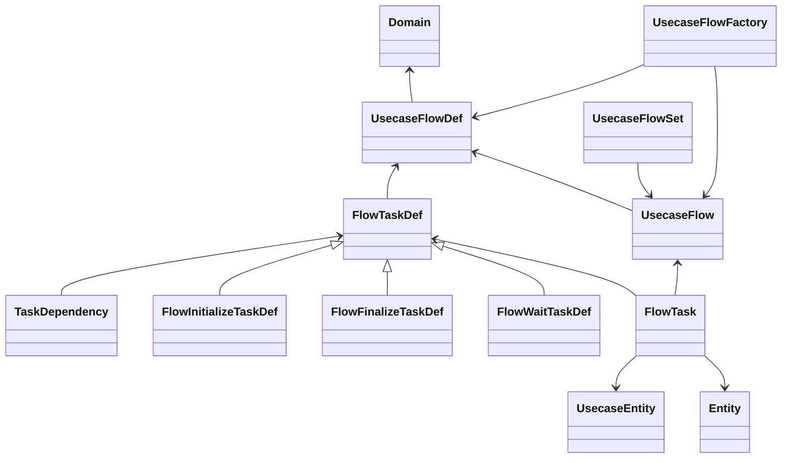

```mermaid
classDiagram
  class Domain
  class UsecaseFlowDef

  class FlowTaskDef
  class FlowInitializeTaskDef
  class FlowFinalizeTaskDef
  class FlowWaitTaskDef

  class TaskDependency
  Domain <-- UsecaseFlowDef
  UsecaseFlowDef <-- FlowTaskDef
  FlowTaskDef <-- TaskDependency
  FlowTaskDef <|-- FlowInitializeTaskDef
  FlowTaskDef <|-- FlowFinalizeTaskDef
  FlowTaskDef <|-- FlowWaitTaskDef

  class UsecaseFlowFactory

  class UsecaseFlowSet
  class UsecaseFlow
  class FlowTask
  class UsecaseEntity

  UsecaseFlowFactory --> UsecaseFlowDef
  UsecaseFlowFactory --> UsecaseFlow

  UsecaseFlowSet --> UsecaseFlow
  UsecaseFlowDef <-- UsecaseFlow
  FlowTaskDef <-- FlowTask
  UsecaseFlow <-- FlowTask

  FlowTask --> UsecaseEntity
  FlowTask --> Entity
```